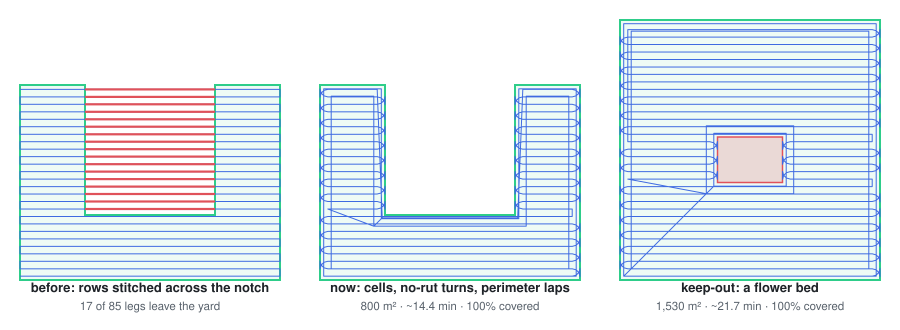

# Changelog

Milestones only — the blow-by-blow (with what forced every change) lives in
[DESIGN-LOG.md](DESIGN-LOG.md).

## Unreleased
**Coverage planner v2 — real yards: L/U shapes, keep-outs, the headland, and what a plan costs**

- **Bug fixed — legs across the notch:** the planner stitched every span of a sweep row together, so
  in any non-convex yard the leg between spans drove straight across the gap (on a U-shaped yard, 29
  of 65 legs; in a real yard that gap is a bed or the house). Rows are now grouped into **cells**
  (boustrophedon cell decomposition) and cells are joined by transit legs that are checked against
  the yard and **routed** around when blocked (Dijkstra over nudged yard corners + keep-out corners)
- **Keep-out zones:** beds, trees, the shed — holes in the sweep for both planners; no-rut turns stay
  a turn radius clear of them. `/api/zones/plan` takes `keepouts`; the touchscreen has **＋ Keep-out**
- **Sonar hotspots → suggested keep-outs:** ≥ 3 obstacle stops within 1.5 m is a stump, not a dog;
  `GET /api/obstacles/hotspots`, offered in the UI while drawing (never added silently)
- **Plan stats before it moves:** lawn m² (minus keep-outs), path vs mowed length, turns, cells,
  **minutes at CRUISE_SPEED**, and an honest **% covered** — which exposed the next item
- **Perimeter laps:** the no-rut planner left the 1.2 m turn headland unmowed (10–14 % of a lawn). It
  now finishes with laps around the yard and every keep-out (tractor order: headlands last). 40 × 40 m
  lawn with a bed: 90.5 % → 100 % covered, 16.7 → 21.7 min
- `missions.py` joins the mypy gate; `scripts/plan_figure.py` draws `docs/coverage-plan.svg` from the
  real planner. Tests 54 → **63**; SITL end-to-end still green on ArduRover 4.7.1

**MowerCarrier Rev A.1 — the carrier PCB is routed (roadmap #38/#39)**
- `hardware/pcb/kicad/`: KiCad 9 project **generated from `design.py`** (schematic from KiCad's own
  symbols → placement → 30 A trunk as solid pours + track keepouts → Freerouting → fuse-clip + GND
  pours). ERC 0 · DRC 0 errors · 0 unconnected · schematic parity 0. Gerbers/drill/pos/BOM in `fab/`,
  3D renders in `hardware/pcb/`. `check.sh` gates ERC + DRC(+parity); a deleted track fails it
- **7 design errors in the Rev A netlist fixed** (details in `kicad/REVIEW.md`): Q1 reversed (no
  reverse-polarity protection), XT60 polarity, e-stop contacts had no supply, K1.COM on two nets,
  unfused PTO (new F5), R_LEN on boot-strapping GPIO12 (→ GPIO33; DRIVE_EN → GPIO32), Form-C relay
  is 20 A not 30 A (→ SLA-12VDC-SL-A, footprint drawn from Songle's drilling drawing)
- **Q1 heatsink designed in:** Fischer SK 104 50,8 STC (9 K/W → ~46 °C rise at 15 A), grounded, with a
  TO-220 insulating kit; placed on the top edge with a GND-only, no-track zone under its fins
- **Main fuse 30 → 20 A:** the Littelfuse ATO holder is 22.5 A continuous / 30 A max (realistic peak ~17.5 A)
- **DRC now 0 of any severity** (silk included; two scoped `.kicad_dru` exceptions) and the generator is
  **deterministic** (name-based/seeded UUIDs — random ones reordered the router input, so the route changed
  run to run); `check.sh --full` fails if the committed board is stale. Schematic/layout SVGs and renders
  are now exported from KiCad (the Rev A concept generators are retired)
- **Before ordering:** caliper the ESP32 row pitch, order Q1's insulating kit — `kicad/REVIEW.md`
- Firmware: DRIVE_EN keeps motor power off until the ESP32 is configured; R_LEN → GPIO33; ported to
  the Arduino-ESP32 **3.x** LEDC API (it no longer compiled on a current core) with a 2.x fallback.
  `check.sh` compiles it when arduino-cli is present
- `setup-dev.sh --kicad` now also installs Java 25, Freerouting 1.9.0 (2.x writes empty routes when
  headless) and arduino-cli + the ESP32 core

**Runs for real, end to end — and running it found 10 bugs**
- **ArduPilot SITL end-to-end:** `scripts/sitl.sh` boots the real ArduRover **4.7.1** firmware
  (skid-steer, home on the Yard), loads this repo's params and puts the companion UI on it;
  `scripts/sitl_smoke.py` drives fence → arm → coverage route in AUTO → E-STOP through the UI's
  own API. `./scripts/check.sh --sitl` runs it (~60 s)
- `scripts/check_parm.py` validates every `.parm` name against live firmware and can load them
- `scripts/setup-dev.sh` + `requirements-dev.txt`: uv, Python 3.12 `.venv`, OpenSCAD, KiCad
  (`--kicad`) — user-level, no Homebrew. `check.sh` now also runs mypy and a strict docs build
- Fixed — found by running against real firmware:
  - 5 param names renamed upstream and silently skipped by Mission Planner's Load:
    `GPS_TYPE`→`GPS1_TYPE`, `GPS_RATE_MS`→`GPS1_RATE_MS`, `ARMING_CHECK`→`ARMING_SKIPCHK`,
    `BATT_LOW_ACT`→`BATT_FS_LOW_ACT`, `TURN_MAX_G`→`ATC_TURN_MAX_G` (+ `GPS1/2_POS_Y`)
  - RC profile put the E-STOP on ch 8 = Rover's mode channel → 4.7 refused to arm; now ch 7
  - mission upload raced the telemetry thread for the link and always timed out
  - seq 0 is ArduPilot's HOME slot — the route's first waypoint was being dropped
  - uploading while in AUTO restarted the current command per item (~100×); now HOLD → upload → AUTO
  - fence upload skipped the mission protocol (blasted items without requests); now
    request/ACK-driven like the route, with a `fence_synced` flag
  - ARM/AUTO were reported optimistically: the UI said "armed"/"running" while the firmware
    refused; ARMED now comes from the heartbeat, a refused AUTO drops the mission to idle with why
  - `--mav` mode never finished a crank, so the engine hung in "cranking" after any E-STOP
  - `--mav` mode ignored ATTITUDE, so the slope/rollover gate saw stale roll/pitch
  - sim: a cleared safety hold left "holding" on screen while the mower drove at 1.4 m/s
- Docs site actually builds now (nav paths were wrong); a hook rewrites links to repo files
  into GitHub URLs; pinned `mkdocs<2` (2.0 drops hooks)
- Tests 52 → 54 (upload protocol through the queue, fence encoding)

## v0.3-sensors — 2026-09-24
**CAD — 32 → 40 printable parts, every new interface datasheet-exact and `assert()`-checked**
- `cad/sensor_mounts.scad`: overhead-sonar collar (JSN-SR04T face-up, 85 mm off the mast axis,
  face level with the antenna top so its ±37.5° cone clears it), split sun hood + 2 braces +
  tilt yoke for the Touch Display 2 (189.32 × 120.24 × 15; window clears the 154.56 × 86.94
  active area with 3 mm per side, 14.8 / 14.1 mm lip bite), dual-RTK tee + 2 antenna plates
  (600 mm ARP-to-ARP; 20 mm tube cut to 628 mm)
- **Antenna fixed to the real part:** ANN-MB-00 per u-blox UBX-18049862 Fig. 1 — 82.0 × 60.0 ×
  22.5, 2× M4 on a 68.0 mm pitch, Ø120 metal ground plane. `gps_top_plate` Ø60 → Ø96 with M4
  nut traps; the ¼"-20 centre stud it assumed does not exist on this antenna
- Fit checks: 11 `assert()`s (bed fit, sonar cone vs antenna/tee, nut traps vs socket, window
  vs active area, brace ears vs yoke, hood swing). `scripts/check.sh` now **fails** on any
  OpenSCAD `ERROR` — openscad exits 0 on a failed assert, so the old gate never saw them
- Sonar/antenna/display dimensions live once in `params.scad`; the assembly proxies read them
- Gallery: 4 new stills (`assembly_dual_rtk`, `closeup_sonar_baseline`, `closeup_display`,
  `sensor_mounts`); every card's size re-synced to its STL (5 were stale, badge was missing)
- `cad/render_hero.py`: reproducible README orbit GIF + social card (`SHOW="hero"`); both re-shot
- GLB: `retro_sonar` + `retro_display` nodes; viewer lists all 40 parts and loads a fresh
  decimated full-machine STL (the old one was the prototype-v1 model)

**Software / firmware**
- `safety.overhead_from_sonar()`: the mast-mounted probe reads distance above its face; this
  adds the 1.370 m face height, treats the 0.20 m blind zone as blocked and no-echo as clear sky
  (+3 tests → 52/52)
- RC / electric-drive mower adapter: `docs/ADAPT-RC-MOWER.md` +
  `firmware/ardupilot/profiles/rc-tracked.parm` (Pixhawk in front of the stock drive controller)
- `rover_params.parm`: moving-baseline `GPS1_POS_Y/GPS2_POS_Y = ∓0.30` for the printed crossbar
- Fixed: companion crashed on Python 3.9 (PEP 604 hints) → `from __future__ import annotations`
- Fixed: route ids collided within one millisecond (flaky `test_teach_records_and_saves`;
  `get_route` could return the wrong route)

**Docs / ordering / repo**
- Build weekends gain Weekend 4; BUILD, WIRING, PRINT_GUIDE, PRINT-QUEUE, vendor SOURCES updated
- ORDER-SHEET: crossbar tube + Ø120 ground-plane disc appended at the end, so the order
  tracker's saved checkmarks keep pointing at the same items (prices are estimates — verify)
- Removed three scratch files that had been committed (`cad/.rebake.sh`, `cad/.t.scad`,
  `cad/.brim_27776.scad`) and ignored their patterns
- Print queue, tool checklist, substitution guide

## 2026-07-12 — Phase 3: the whole rig
- Attachments designed + policy-coded with tests (45/45): self-dumping power bagger,
  DeWalt 60V blower/trimmer boom, FIMCO 30-gal tow sprayer with speed-proportional
  dosing, TPMS, ignition + choke sequence
- No-rut turn planner: smooth-U / 3-point-K headland turns (never pivots)
- 8 printable attachment brackets — 32 parts total, all bed-gated + brim-baked
- Site: accessory bay (interchangeable attachments), dump demo, animated turn
  physics, exploded view, X-ray, guided tour, AR
- Geofence: draw-on-map boundary, persisted, pushed to ArduPilot as an inclusion fence
- Hosted CI blocked by account billing → `scripts/check.sh` runs the same gates locally

## [v0.2-design](https://github.com/zohebzma2-cmyk/autonomous-mower/releases/tag/v0.2-design) — 2026-07-12
- Spec-true machine model: all four envelope numbers match the published ZT X 52
  figures exactly (1968 × 1610 × 1039 mm, 1321 mm deck)
- Blades + spindles in a hollow deck; multi-material GLB with baked animations
- Design log + constraints A–Z + ROADMAP-75 + machine-readable order sheet

## [fabrication-2026-07-10](https://github.com/zohebzma2-cmyk/autonomous-mower/releases/tag/fabrication-2026-07-10)
- Machinist package: 8 DXF flat parts + dimensioned PDFs + 16 STEP solids (30 MB zip)
- MowerCarrier Rev A carrier-PCB design package (power tree + kill chain + ESP32)

## [prototype-v1](https://github.com/zohebzma2-cmyk/autonomous-mower/releases/tag/prototype-v1) — 2026-06-26
- One-day design sprint: 23→24 printable parts, verified order sheet (~$1.6k),
  control software with sim, ESP32 fail-to-neutral firmware, ArduPilot params,
  wiring + kill chain, build manual — then open-sourced (MIT)
