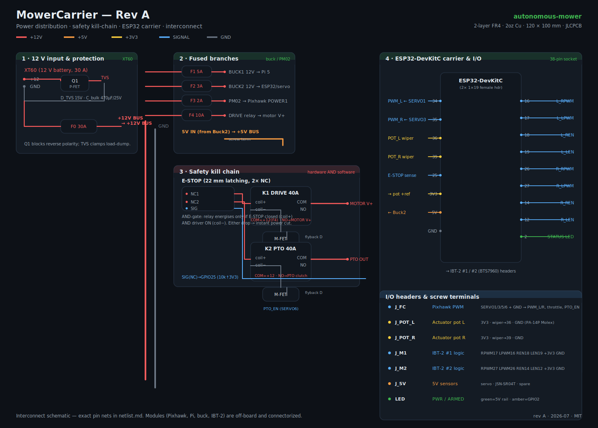
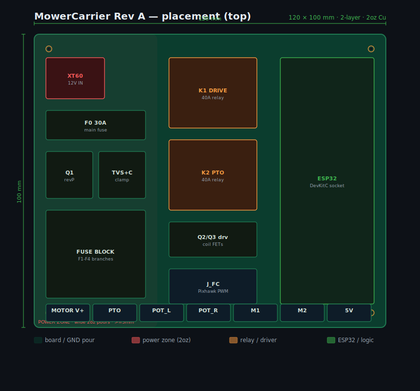

# MowerCarrier — custom carrier PCB (Rev A)

A single 2-layer board that replaces the hand-wired rat's nest with one clean,
serviceable, conformal-coatable assembly. It consolidates the retrofit's
**power distribution**, **safety kill-chain**, and **ESP32 lap-bar controller**
onto one board that every off-board module plugs into by connector.

| | |
|---|---|
| **Board** | 120 × 100 mm, 2-layer FR4, **2 oz copper** (high-current pours) |
| **Fab/assembly** | JLCPCB (economic PCBA for SMD; hand-solder the THT connectors) |
| **License** | MIT (hardware too — remix it) |
| **Status** | Rev A design package — schematic + placement + netlist + BOM, ready to route in KiCad |



## Why a carrier board (and why *not* a from-scratch board)

The retrofit deliberately reuses proven modules — **Pixhawk 6C** (ArduPilot),
**Raspberry Pi 5 + Hailo**, **buck converters**, **BTS7960 (IBT-2)** motor
drivers, **simpleRTK2B**. Re-implementing those on a custom board would add risk
for no benefit. What *is* worth a board is the **glue**: the 30 A power tree, the
fused branches, the reverse-polarity + load-dump protection, and — most
importantly — the **safety kill-chain**, which is fiddly and dangerous to
hand-wire and must be correct every time. So MowerCarrier is an
**interconnect + power + safety** board. Modules connect via XT60, screw
terminals, and 2.54 mm headers.

## Board sections

1. **12 V input & protection** — XT60 in → reverse-polarity P-FET (Q1) → 30 A
   main fuse → +12 V bus. A TVS clamps automotive load-dump; a bulk cap steadies
   the rail.
2. **Fused branches** — individually fused feeds to Buck #1 (Pi), Buck #2
   (ESP32/servo/sensors), the PM02 (Pixhawk), and the 10 A drive-relay leg.
3. **Safety kill-chain** — two 40 A relays (K1 DRIVE, K2 PTO) wired as a
   **hardware-AND-software gate**: the relay coil's **high side** runs through the
   E-STOP NC contact (hardware kill) and its **low side** through a MOSFET the
   controller drives (software enable). *Either* dropping cuts power instantly.
   A second E-STOP contact signals ESP32 `GPIO25` for fail-to-neutral.
4. **ESP32-DevKitC carrier & I/O** — the DevKit sockets into two female headers;
   every firmware net (`lapbar_controller.ino`) breaks out to screw terminals and
   pin headers: FC PWM in, pot feedback, BTS7960 logic ×2, status LEDs.

Exact connectivity is in **[netlist.md](netlist.md)**; parts in
**[BOM.md](BOM.md)**; how to order in **[FABRICATION.md](FABRICATION.md)**.



## Design rules (KiCad / JLCPCB)

- 2-layer, 1.6 mm FR4, **2 oz copper**. Bottom = GND pour; top = signal + power.
- **Power zone** (left ~42 mm): pour wide ≥3 mm / poured copper for the 30 A and
  10 A paths; keep the reverse-P-FET and fuse in this zone.
- Min trace/space 6/6 mil is plenty for signals; power is poured, not traced.
- 4× M3 mounting holes, 5 mm in from each corner.
- Clearance ≥ 2 mm around the relays; keep relay coil-driver flyback diodes
  right at the coil pins.

## Reproduce / edit the drawings

```bash
python3 gen_schematic.py   # -> schematic.svg
python3 gen_layout.py      # -> layout.svg
```

Both are dependency-free (stdlib SVG). The schematic is a **block/net-level**
drawing for review; the authoritative net connectivity for routing lives in
`netlist.md`. Rev A is meant to be opened in **KiCad**, symbols/footprints
assigned from the BOM, and routed — the hard part (what connects to what, the
safety topology, the part choices) is done.

## Safety note

The kill-chain topology here is the whole point — **wire and bench-test it before
anything can move**, exactly as `docs/WIRING.md §3` says. Blades stay physically
disconnected until drive + nav + every failsafe is proven. This board makes the
safe wiring repeatable; it does not replace testing it.
