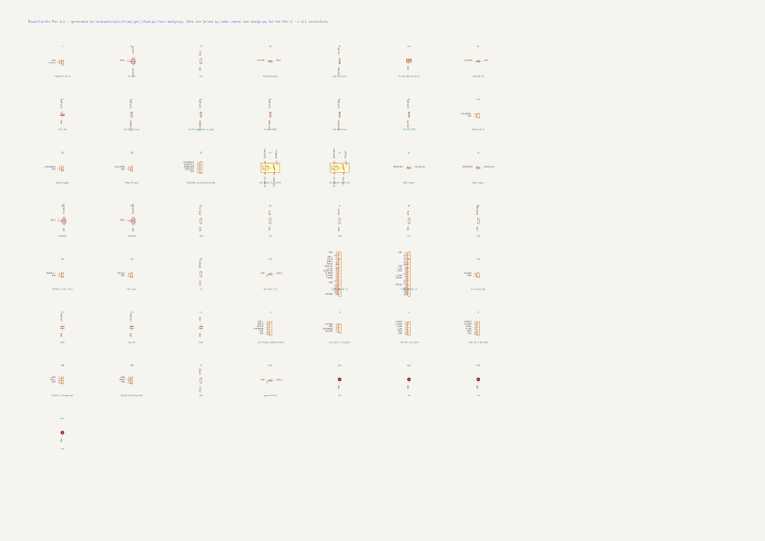
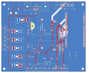

# MowerCarrier — custom carrier PCB (Rev A)

A single 2-layer board that replaces the hand-wired rat's nest with one clean,
serviceable, conformal-coatable assembly. It consolidates the retrofit's
**power distribution**, **safety kill-chain**, and **ESP32 lap-bar controller**
onto one board that every off-board module plugs into by connector.

| | |
|---|---|
| **Board** | 120 × 100 mm, 2-layer FR4, **2 oz copper** (high-current pours) |
| **Fab/assembly** | JLCPCB (economic PCBA for SMD; hand-solder the THT connectors) |
| **License** | MIT (hardware too — remix it) |
| **Status** | **Rev A.1 routed** — generated KiCad 9 project in [`kicad/`](kicad/) (ERC 0 · DRC 0 errors · parity 0), Gerbers in `kicad/fab/`. **Human pre-fab review pending: [`kicad/REVIEW.md`](kicad/REVIEW.md)** |


*Rev A.1 as generated. The schematic and layout drawings below are exported from the KiCad
project by `kicad/gen_kicad.sh`, so they always match the board.*



## Why a carrier board (and why *not* a from-scratch board)

The retrofit deliberately reuses proven modules — **Pixhawk 6C** (ArduPilot),
**Raspberry Pi 5 + Hailo**, **buck converters**, **BTS7960 (IBT-2)** motor
drivers, **simpleRTK2B**. Re-implementing those on a custom board would add risk
for no benefit. What *is* worth a board is the **glue**: the 30 A power tree, the
fused branches, the reverse-polarity + load-dump protection, and — most
importantly — the **safety kill-chain**, which is fiddly and dangerous to
hand-wire and must be correct every time. So MowerCarrier is an
**interconnect + power + safety** board. Modules connect via XT60, screw
terminals, and 2.54 mm headers.

## Board sections

1. **12 V input & protection** — XT60 in → reverse-polarity P-FET (Q1, on a 9 K/W
   Fischer SK104 heatsink) → 20 A main fuse → +12 V bus. A TVS clamps load-dump
   transients; a bulk cap steadies the rail.
2. **Fused branches** — individually fused feeds to Buck #1 (Pi), Buck #2
   (ESP32/servo/sensors, and the e-stop feed), the PM02 (Pixhawk), the 10 A
   drive-relay leg and the 7.5 A PTO-relay leg.
3. **Safety kill-chain** — two 30 A relays (K1 DRIVE, K2 PTO) wired as a
   **hardware-AND-software gate**: the relay coil's **high side** runs through the
   E-STOP NC contact (hardware kill) and its **low side** through a MOSFET the
   controller drives (software enable). *Either* dropping cuts power instantly.
   A second E-STOP contact signals ESP32 `GPIO25` for fail-to-neutral.
4. **ESP32-DevKitC carrier & I/O** — the DevKit sockets into two female headers;
   every firmware net (`lapbar_controller.ino`) breaks out to screw terminals and
   pin headers: FC PWM in, pot feedback, BTS7960 logic ×2, status LEDs.

Exact connectivity + parts live in **[kicad/design.py](kicad/design.py)** (the grouped BOM
with LCSC numbers is `kicad/fab/mowercarrier-bom.csv`); pre-fab checklist in
**[kicad/REVIEW.md](kicad/REVIEW.md)**; how to order in **[FABRICATION.md](FABRICATION.md)**.
`netlist.md` / `BOM.md` are the Rev A originals, kept for history.



## Design rules (KiCad / JLCPCB)

- 2-layer, 1.6 mm FR4, **2 oz copper**. GND poured on both layers; the trunk
  (+12V_IN bottom, +12V_RP top, +12V_BUS bottom) is solid pours with track keepouts.
- **Power zone** (left): fuse column over the bottom bus pour, output terminals on
  the left edge, Q1 + heatsink on the top edge.
- Min trace/space 6/6 mil is plenty for signals; power is poured, not traced.
- 4× M3 mounting holes, 5 mm in from each corner.
- Clearance ≥ 2 mm around the relays; keep relay coil-driver flyback diodes
  right at the coil pins.

## Reproduce / edit

```bash
./scripts/setup-dev.sh --kicad      # KiCad 9, Java 25, Freerouting 1.9.0
hardware/pcb/kicad/gen_kicad.sh     # design.py -> schematic, PCB, fab/, drawings, renders
./scripts/check.sh --full           # ERC + DRC + "regenerates byte-identically" gate
```

Edit `kicad/design.py` (parts, nets) or `kicad/gen_pcb.py` (placement, pours), never the
generated `.kicad_*` files. Generation is deterministic: an unchanged design reproduces the
board byte for byte.

## Safety note

The kill-chain topology here is the whole point — **wire and bench-test it before
anything can move**, exactly as `docs/WIRING.md §3` says. Blades stay physically
disconnected until drive + nav + every failsafe is proven. This board makes the
safe wiring repeatable; it does not replace testing it.
