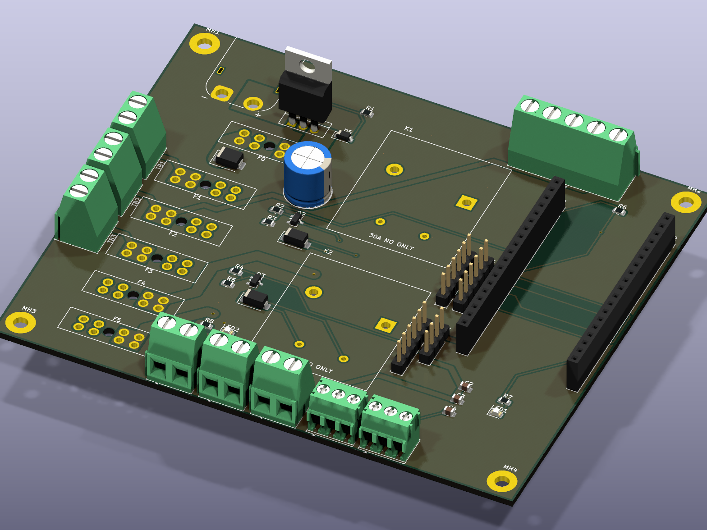

# MowerCarrier Rev A.1 — KiCad 9 project (generated)



Power input + reverse-polarity protection + 30 A main fuse + five fused branches, the
hardware kill chain (E-stop NC contacts in series with FET-switched relay coils), and the
ESP32-DevKitC carrier for the lap-bar controller. 120 × 100 mm, 2 layers, 2 oz copper.

**The `.kicad_*` files are generated. Edit `design.py` (parts + nets) or `gen_pcb.py`
(placement, pours, routing), then regenerate** — don't hand-edit the outputs, they'd be
overwritten.

```bash
./scripts/setup-dev.sh --kicad          # once: KiCad 9, Java 25 JRE, Freerouting 1.9.0, arduino-cli
hardware/pcb/kicad/gen_kicad.sh         # schematic -> placement -> pours -> autoroute -> GND pour
./scripts/check.sh                      # runs ERC + DRC (errors, schematic parity) on the result
```

| File | What |
|---|---|
| `design.py` | single source of truth: every part (symbol, footprint, LCSC/MPN) and every pin's net; the Rev A → A.1 corrections are listed at the top |
| `gen_schematic.py` | writes `mowercarrier.kicad_sch` from KiCad's own library symbols (net labels on every pin, no-connect flags on the rest) |
| `gen_footprints.py` | `MowerCarrier.pretty/` — the Songle SLA relay footprint, from Songle's drilling drawing |
| `gen_pcb.py` | placement table, 30 A trunk pours + track keepouts, Freerouting, fuse-clip pours, GND pours |
| `fab/` | Gerbers + drill (zip for JLCPCB), pick-and-place CSV, grouped BOM with LCSC numbers |
| `REVIEW.md` | **read before ordering** — what's verified, what isn't, and the items a human must sign off |

## Verified (by the tools, on every regeneration)

- **ERC: 0 violations.** The exported KiCad netlist matches `design.py` net for net (39 nets).
- **DRC: 0 errors, 0 unconnected, 0 schematic-parity issues** (16 silkscreen warnings: edge-mounted connector outlines + 3 overlapping labels — cosmetic).
- Footprint pads == symbol pins for every part (asserted by the generator).

## Not verified by tools — see REVIEW.md

Current capacity and heat (Q1 needs a heatsink), the ESP32 row pitch of *your* DevKit,
the fuse-holder current rating, and a human look at the autorouted layout.
